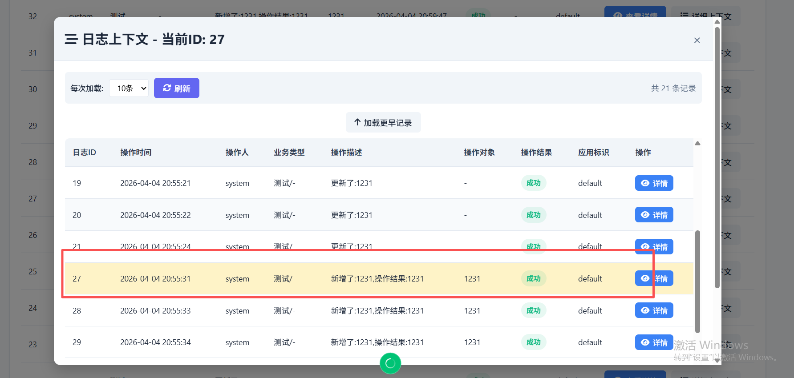

# 操作日志使用手册

## 1. 概述

common-audit-log 是一个基于 AOP 的审计日志组件，支持操作日志的自动收集、差异比对和存储。该组件通过注解方式轻松集成到 Spring Boot 应用中，实现操作日志的自动化记录。

## 2. 核心特性

- **注解驱动**：通过简单的注解即可实现日志记录
- **SpEL 表达式支持**：动态填充日志操作描述,操作分类,操作数据id等信息
- **支持多层级嵌套调用日志(可选)**：支持多层级嵌套方法调用日志
- **条件性记录**：支持根据条件表达式判断是否记录日志
- **多种异步收集策略**：支持内存队列和Disruptor高性能无锁队列,jdk queue
- **对象池优化**：内置日志收集对象池,降低gc压力，支持批量归还
- **高性能Disruptor队列(可选)**：基于LMAX Disruptor的无锁队列，适用于高并发场景
- **批量保存支持**：异步模式下支持批量保存，大幅提升写入性能（5-10倍提升）
- **上下文滚动查询**：选中任意单条日志记录，一键查看其前后的操作上下文，完整追溯操作流程
- **配套查询系统(可选)**：支持多维条件查询日志,开箱即用
- **多数据库支持**：支持MySQL、SQLite、H2等多种数据库,支持存储表名自定义，理论上来说可适配任何存储，甚至是文件系统
- **可扩展的差异比对**：支持操作前后数据差异比对,默认不对比,内置: FieldDiffHandler(使用 java-object-diff 实现字段对比) 可配合 @LogDiff 注解使用,也支持自定义对比器
- **极简的自适应场景配置**：自动根据日志收集场景:低,中,高频场景自适应配置
- **分表支持**：支持分表,默认分表策略根据应用id hash取模
- **灵活的扩展模块**: 几乎所有实现模块都可以扩展实现: 日志id生成器(LogIdGenerator),差异比较器(ObjectDiffHandler),日志收集器(AuditLogCollector),日志存储(AuditLogStoreService),日志查询（AuditLogQueryService）,日志上下文自动填充处理类(AuditLogFillHandler)等，只需要注入将自定义的实现注入spring容器即可


## 3. 模块说明

| 模块 | 说明                       |
|------|--------------------------|
| common-audit-log-core | 核心功能模块，包含注解、AOP 切面、差异比对等 |
| common-audit-log-runtime | 运行时配置模块，包含自动配置和属性配置      |
| common-audit-log-web | 日志查询配套系统和接入示例            |

## 4. 快速开始

### 4.1 添加依赖

```xml
<dependency>
    <groupId>com.taoyuanx</groupId>
    <artifactId>common-audit-log-core</artifactId>
    <version>1.0.0</version>
</dependency>
<dependency>
    <groupId>com.taoyuanx</groupId>
    <artifactId>common-audit-log-runtime</artifactId>
    <version>1.0.0</version>
</dependency>
```

### 4.2 配置文件

在 `application.yml` 中添加配置：

**全部自定义配置**
```yaml
audit:
  log:
    # 是否启用审计日志功能
    enabled: true
    # 是否异步处理日志
    async: true
    # 异步队列大小
    log-queue-size: 1000
    # 异步收集线程收集间隔（毫秒）
    collect-interval: 50
    # 收集队列满时的等待时间（毫秒），负数则入队失败丢弃
    queue-full-wait-time: 2000
    # 需要记录日志的package
    basePackages: com.taoyuanx.common.log.web
    # 是否允许嵌套方法调用日志收集
    allowNestLog: true
    # 是否使用对象池
    useObjectPool: true
    # 对象池最大大小
    objectPoolMaxSize: 1024
    # 对象池初始大小
    objectPoolInitSize: 100
    # 是否使用Disruptor高性能队列
    useDisruptor: false
    # Disruptor环形缓冲区大小，必须是2的幂次方
    ringBufferSize: 1024
    # 应用标识
    appId: default
    # 是否启用分表(默认关闭)
    enableSharding: true
    # 分表数量
    shardingTableCount: 2
    # 日志表名称
    logTableName: op_log
    # 日志明细表名称(用于记录操作前后对比结果)
    logDetailTableName: op_log_detail
    # 是否启用日志详情表(从操作日志表隔离op_dsl 字段),默认不启用
    enableLogDetailTable: false
    # 批量保存配置（仅异步模式有效）
    batch-enabled: true           # 是否启用批量保存
    batch-size: 100               # 批量大小
    batch-max-wait-time: 500     # （持久化）最大等待时间（毫秒）
```

**自适应场景配置**

```yaml
audit:
  log:
    # 是否启用审计日志功能
    enabled: true
    # 需要记录日志的package
    basePackages: com.taoyuanx.common.log.web
    # 日志收集场景：低频(low)、普通(normal)、高频(high)
    logScene: high
```

**三种场景默认配置说明:**

| 配置项 | 低频(low) | 普通(normal) | 高频(high) |
|--------|-----------|--------------|------------|
| **适用QPS** | < 100 | 100 - 2000 | > 2000 |
| **收集方式** | 同步收集 | 异步队列(JDK) | 无锁队列(Disruptor) |
| **对象池** | ❌ 不使用 | ✅ 使用 (max:256, init:50) | ✅ 使用 (max:4096, init:200) |
| **批量保存** | ❌ 不启用 | ✅ 启用 (batchSize:30, waitTime:200ms) | ✅ 启用 (batchSize:100, waitTime:100ms) |
| **队列大小** | - | 1000 | 8192 (ringBuffer) |
| **收集间隔** | - | 50ms | - |
| **性能特点** | 简单直接 | 平衡性能和资源 | 极致性能,对象立即归还 |
| **内存开销** | 低 | 中 | 中高(对象拷贝) |

**配置选择建议:**
- **低频场景**: 适用于定时任务、后台管理等低频率操作,同步处理简单可靠
- **普通场景**: 适用于大多数业务系统,异步处理+小批量保存,平衡性能和资源消耗
- **高频场景**: 适用于高并发核心业务,采用Disruptor无锁队列+对象池+立即归还策略,支持5万+ QPS
### 4.3 启用自动配置

确保 Spring Boot 启动类扫描到组件包：

```java
@SpringBootApplication
@ComponentScan(basePackages = {"com.taoyuanx.common.audit.log"})
public class Application {
    public static void main(String[] args) {
        SpringApplication.run(Application.class, args);
    }
}
```

## 5. 核心注解

### 5.1 @OperateLog

标准的操作日志注解，用于标记需要记录日志的方法。

**属性说明：**

| 属性 | 类型 | 必填 | 说明 |
|------|------|------|------|
| bizType | String | 是 | 业务类型，如"用户管理"、"订单管理" |
| subBizType | String | 否 | 子业务类型 |
| operateObject | String | 否 | 操作对象，支持 SpEL 表达式 |
| success | String | 是 | 操作成功时的日志描述模板，支持 SpEL 表达式 |
| fail | String | 否 | 操作失败时的日志描述模板，支持 SpEL 表达式 |
| condition | String | 否 | 记录条件，支持 SpEL 表达式，true 才记录 |
| ignoreException | Class[] | 否 | 忽略的异常类型 |

**使用示例：**

```java
@PostMapping("/user/add")
@ResponseBody
@OperateLog(
    success = "'新增了用户:' + #result.get('username')",
    fail = "'新增用户失败:' + #error.message",
    bizType = "用户管理",
    operateObject = "#result.get('username')"
)
public Map addUser(@RequestBody Map<String, Object> params) {
    // 业务逻辑
    return params;
}
```

### 5.2 @SimpleOperateLog

简化版操作日志注解，适用于简单场景。

**属性说明：**

| 属性 | 类型 | 必填 | 说明 |
|------|------|------|------|
| bizType | String | 是 | 业务类型 |
| subBizType | String | 否 | 子业务类型 |
| operateObject | String | 否 | 操作对象 |
| operateDesc | String | 是 | 操作描述，支持 SpEL 表达式 |

**使用示例：**

```java
@PostMapping("/user/add")
@ResponseBody
@SimpleOperateLog(
    operateDesc = "'新增了用户:' + #params.get('username')",
    bizType = "用户管理",
    operateObject = "#params.get('username')"
)
public Map addUser(@RequestBody Map<String, Object> params) {
    // 业务逻辑
    return params;
}
```

### 5.3 @LogDiff

数据差异比对注解，配合 @OperateLog 使用，用于记录数据变更前后对比。

**属性说明：**

| 属性 | 类型 | 必填 | 说明 |
|------|------|------|------|
| before | String | 否 | 操作前数据获取表达式 |
| after | String | 否 | 操作后数据获取表达式 |
| diffHandler | Class | 否 | 对象对比器，默认 NoDiffHandler |

**使用示例：**

```java
// 新增操作（只有操作后数据）
@PostMapping("/user/add")
@ResponseBody
@OperateLog(
    success = "'新增了用户:' + #result.get('username')",
    bizType = "用户管理",
    operateObject = "#result.get('username')"
)
@LogDiff(after = "#result")
public Map addUser(@RequestBody Map<String, Object> params) {
    // 业务逻辑
    return result;
}

// 删除操作（只有操作前数据）
@PostMapping("/user/delete")
@ResponseBody
@OperateLog(
    success = "'删除了用户:' + #params.get('userId')",
    bizType = "用户管理"
)
@LogDiff(before = "#result.get('deletedUser')")
public Map deleteUser(@RequestBody Map<String, Object> params) {
    // 业务逻辑
    return result;
}

// 更新操作（有前后数据）
@PostMapping("/user/update")
@ResponseBody
@OperateLog(
    success = "'更新了用户:' + #result.get('username')",
    bizType = "用户管理"
)
public Map updateUser(@RequestBody Map<String, Object> params) {
    // 通过上下文设置前后数据
    AuditLogContextUtil.set(AuditLogContextUtil.CONTEXT_KEY_BEFORE_OBJECT, beforeUser);
    AuditLogContextUtil.set(AuditLogContextUtil.CONTEXT_KEY_AFTER_OBJECT, afterUser);
    return result;
}
```

## 6. SpEL 表达式支持

组件支持 Spring SpEL 表达式，常用变量如下：

| 变量 | 说明 | 示例 |
|------|------|------|
| `#params` | 方法参数 | `#params.get('username')` |
| `#result` | 方法返回值 | `#result.get('id')` |
| `#error` | 异常对象 | `#error.message` |
| `#operateObject` | 操作对象 | `#operateObject` |

**示例：**

```java
@OperateLog(
    success = "'操作人:' + #params.get('operator') + ' 处理了订单:' + #result.get('orderId')",
    bizType = "订单管理",
    operateObject = "#result.get('orderId')"
)
```

## 7. 上下文工具类
**直接保存日志时，上下文无用，不要使用该工具类,必须要配合注解使用才行**
`AuditLogContextUtil` 提供上下文管理功能，用于在代码中设置自定义信息。

### 7.1 常用常量

| 常量 | 说明 |
|------|------|
| CONTEXT_KEY_OPERATOR | 操作人 |
| CONTEXT_KEY_TENANT | 租户 |
| CONTEXT_KEY_BEFORE_OBJECT | 操作前对象 |
| CONTEXT_KEY_AFTER_OBJECT | 操作后对象 |
| CONTEXT_KEY_OPERATE_DSL | 操作 DSL |
| CONTEXT_KEY_TRACE_ID | 追踪 ID |
| CONTEXT_KEY_EXT | 扩展信息 |

### 7.2 常用方法

```java
// 设置操作人
AuditLogContextUtil.set(AuditLogContextUtil.CONTEXT_KEY_OPERATOR, "admin");

// 设置租户
AuditLogContextUtil.set(AuditLogContextUtil.CONTEXT_KEY_TENANT, "tenant1");

// 设置操作前后对象（用于差异比对）
AuditLogContextUtil.set(AuditLogContextUtil.CONTEXT_KEY_BEFORE_OBJECT, beforeData);
AuditLogContextUtil.set(AuditLogContextUtil.CONTEXT_KEY_AFTER_OBJECT, afterData);

// 设置自定义操作详情
AuditLogContextUtil.set(AuditLogContextUtil.CONTEXT_KEY_OPERATE_DSL, customDetail);

// 设置扩展信息
AuditLogContextUtil.set(AuditLogContextUtil.CONTEXT_KEY_EXT, extInfo);

// 设置追踪 ID
AuditLogContextUtil.set(AuditLogContextUtil.CONTEXT_KEY_TRACE_ID, traceId);


```

## 8. 使用场景示例

### 8.1 简单日志记录

```java
@PostMapping("/simple/log")
@ResponseBody
@OperateLog(
    success = "'新增了:' + #params.get('flowBizNo') + ',操作结果:' + #result.get('flowBizNo')",
    bizType = "测试",
    operateObject = "#params.get('flowBizNo')"
)
public Map logSimple(@RequestBody Map<String, Object> params) {
    return params;
}
```

### 8.2 带差异比对的新增操作

```java
@PostMapping("/logWithDetail")
@ResponseBody
@OperateLog(
    success = "'新增了:' + #params.get('flowBizNo')",
    bizType = "测试",
    operateObject = "#result.get('addObject').get('name')"
)
@LogDiff(after = "#result.get('addObject')")
public Map logWithDetail(@RequestBody Map<String, Object> params) {
    Map<String, Object> result = new HashMap<>();
    Map<String, Object> addObject = new HashMap<>();
    addObject.put("name", "张三");
    addObject.put("age", 25);
    result.put("addObject", addObject);
    return result;
}
```

### 8.3 带差异比对的删除操作

```java
@PostMapping("/logWithDelete")
@ResponseBody
@OperateLog(
    success = "'删除了:' + #params.get('flowBizNo')",
    bizType = "测试",
    operateObject = "#result.get('deleteObject').get('name')"
)
@LogDiff(before = "#result.get('deleteObject')")
public Map logWithDelete(@RequestBody Map<String, Object> params) {
    Map<String, Object> result = new HashMap<>();
    Map<String, Object> deleteObject = new HashMap<>();
    deleteObject.put("name", "李四");
    deleteObject.put("age", 30);
    result.put("deleteObject", deleteObject);
    return result;
}
```

### 8.4 带差异比对的更新操作

```java
@PostMapping("/logWithUpdate")
@ResponseBody
@OperateLog(
    success = "'更新了:' + #params.get('flowBizNo')",
    bizType = "测试",
    operateObject = "#result.get('name')"
)
public Map logWithUpdate(@RequestBody Map<String, Object> params) {
    // 设置操作前数据
    Map<String, Object> before = new HashMap<>();
    before.put("name", "王五");
    before.put("age", 35);
    
    // 设置操作后数据
    Map<String, Object> after = new HashMap<>();
    after.put("name", "王五");
    after.put("age", 36);
    
    AuditLogContextUtil.set(AuditLogContextUtil.CONTEXT_KEY_BEFORE_OBJECT, before);
    AuditLogContextUtil.set(AuditLogContextUtil.CONTEXT_KEY_AFTER_OBJECT, after);
    
    return params;
}
```

### 8.5 自定义日志详情

```java
@PostMapping("/logWithCustomDetail")
@ResponseBody
@OperateLog(
    success = "'自定义日志详情:' + #params.get('flowBizNo')",
    bizType = "测试",
    operateObject = "#result.get('name')"
)
public Map logWithCustomDetail(@RequestBody Map<String, Object> params) {
    Map<String, Object> detail = new HashMap<>();
    detail.put("customField1", "value1");
    detail.put("customField2", "value2");
    
    AuditLogContextUtil.set(AuditLogContextUtil.CONTEXT_KEY_OPERATE_DSL, detail);
    return params;
}
```

### 8.6 带扩展信息的日志

```java
@PostMapping("/logWithExt")
@ResponseBody
@OperateLog(
    success = "'自定义日志详情:' + #params.get('flowBizNo')",
    bizType = "测试",
    operateObject = "#result.get('name')"
)
public Map logWithExt(@RequestBody Map<String, Object> params) {
    AuditLogContextUtil.set(AuditLogContextUtil.CONTEXT_KEY_OPERATE_DSL, params.get("detail"));
    AuditLogContextUtil.set(AuditLogContextUtil.CONTEXT_KEY_EXT, params.get("ext"));
    return params;
}
```

### 8.7 条件性日志记录

```java
@PostMapping("/logConditional")
@ResponseBody
@OperateLog(
    success = "'自定义日志详情:' + #params.get('flowBizNo')",
    bizType = "测试",
    operateObject = "#result.get('name')",
    condition = "#result.get('condition') == true"
)
public Map logConditional(@RequestBody Map<String, Object> params) {
    // 只有当 condition 为 true 时才会记录日志
    return params;
}
```

### 8.8 嵌套线程日志

```java
@GetMapping("/nestLogTest")
@ResponseBody
@OperateLog(
    success = "'嵌套日志层级:' + #operateObject",
    bizType = "嵌套日志测试",
    operateObject = "#operateObject"
)
public Map nestLogTest(Long operateObject) {
    // 调用其他服务方法，该方法的日志会嵌套在当前日志中
    demoLogService.businessLog(2L);
    return new HashMap();
}
```

### 8.9 高性能场景下的日志记录

在高并发场景下，可以结合对象池和Disruptor收集器使用：

```java
@Service
public class HighPerformanceService {
    
    @OperateLog(
        success = "'批量处理完成，共处理:' + #result.get('count') + '条记录'",
        bizType = "批量处理",
        operateObject = "#params.get('batchId')"
    )
    public Map batchProcess(@RequestBody Map<String, Object> params) {
        // 批量处理逻辑
        Map<String, Object> result = new HashMap<>();
        result.put("count", 1000);
        return result;
    }
}
```

对应的配置：
```yaml
audit:
  log:
    enabled: true
    async: true
    useDisruptor: true
    ringBufferSize: 4096
    useObjectPool: true
    objectPoolMaxSize: 2048
```

### 8.10 多租户环境下的日志记录

```java
@RestController
public class TenantController {
    
    @PostMapping("/tenant/update")
    @ResponseBody
    @OperateLog(
        success = "'更新了租户配置:' + #params.get('tenantId')",
        bizType = "租户管理",
        operateObject = "#params.get('tenantId')"
    )
    public Map updateTenantConfig(@RequestBody Map<String, Object> params) {
        // 设置租户信息
        AuditLogContextUtil.set(AuditLogContextUtil.CONTEXT_KEY_TENANT, params.get("tenantId"));
        
        // 业务逻辑
        return params;
    }
}
```

## 9. 直接记录日志（AuditLogService）

除了使用注解方式，还可以直接通过 `AuditLogService` 快速记录日志，适用于非AOP场景或需要在代码中灵活控制日志记录的场合。

### 9.1 注入服务

```java
@Service
@RequiredArgsConstructor
public class UserService {
    private final AuditLogService auditLogService;
    
    // 业务方法...
}
```

### 9.2 便捷方法列表

| 方法 | 参数数量 | 适用场景 |
|------|---------|----------|
| `logSuccess()` | 3个 | 简单成功日志 |
| `logSuccessWithObject()` | 4个 | 带操作对象的成功日志 |
| `logError()` | 4个 | 失败/异常日志 |
| `logWithExt()` | 4个 | 带扩展信息的日志 |
| `logCustom()` | 1个Consumer | 完全自定义日志 |

### 9.3 logSuccess() - 简单成功日志

**适用场景:** 简单的操作记录，只需要业务类型、操作类型和描述

**方法签名:**
```java
public void logSuccess(String bizType, String subType, String operateDesc)
```

**使用示例:**
```java
// 用户登录
auditLogService.logSuccess("USER", "LOGIN", "用户登录成功");

// 订单创建
auditLogService.logSuccess("ORDER", "CREATE", "创建订单ORD001");

// 数据清理
auditLogService.logSuccess("DATA", "CLEANUP", "清理过期缓存数据");

// 定时任务
auditLogService.logSuccess("TASK", "EXECUTE", "执行每日数据统计任务");
```

### 9.4 logSuccessWithObject() - 带操作对象的成功日志

**适用场景:** 需要记录具体操作了哪个对象

**方法签名:**
```java
public void logSuccessWithObject(String bizType, String subType,
                                  String operateObject, String operateDesc)
```

**使用示例:**
```java
// 修改用户信息
auditLogService.logSuccessWithObject("USER", "UPDATE", 
    "user_12345", "修改用户手机号");

// 取消订单
auditLogService.logSuccessWithObject("ORDER", "CANCEL", 
    "order_67890", "用户主动取消订单");

// 删除商品
auditLogService.logSuccessWithObject("PRODUCT", "DELETE", 
    "prod_999", "下架过期商品");

// 审核通过
auditLogService.logSuccessWithObject("APPROVAL", "PASS", 
    "apply_456", "请假申请审核通过");
```

### 9.5 logError() - 失败日志

**适用场景:** 记录操作失败的情况，包含错误信息

**方法签名:**
```java
public void logError(String bizType, String subType,
                     String operateDesc, String errorMsg)
```

**使用示例:**
```java
// 支付回调失败
auditLogService.logError("PAYMENT", "CALLBACK", 
    "支付回调处理", "订单状态更新失败: timeout");

// 权限校验失败
auditLogService.logError("AUTH", "VERIFY", 
    "接口权限校验", "用户无访问权限: /api/admin");

// 数据同步失败
try {
    syncDataService.sync();
} catch (Exception e) {
    auditLogService.logError("SYNC", "IMPORT", 
        "从ERP同步数据", e.getMessage());
}

// 文件上传失败
auditLogService.logError("FILE", "UPLOAD", 
    "上传Excel文件", "文件格式不支持: .xlsx");
```

### 9.6 logWithExt() - 带扩展信息的日志

**适用场景:** 需要记录业务元数据（如IP地址、设备信息、请求上下文等）

**方法签名:**
```java
public void logWithExt(String bizType, String subType,
                       String operateDesc, Object ext)
```

**重要说明:**
- **ext**: 用于记录业务元数据（如IP、设备信息、统计信息等）
- **operate_dsl**: 如需记录变更详情，请使用 `logCustom()` 方法设置 `operateDsl` 字段

**使用示例:**
```java
// 记录登录上下文信息
Map<String, Object> ext = new HashMap<>();
ext.put("ip", "192.168.1.100");
ext.put("deviceId", "device_001");
ext.put("userAgent", "Mozilla/5.0...");
auditLogService.logWithExt("USER", "LOGIN", "用户登录成功", ext);

// 记录批量操作的执行上下文
Map<String, Object> batchExt = new HashMap<>();
batchExt.put("batchNo", "BATCH_20240101");
batchExt.put("operator", "admin");
batchExt.put("executeTime", System.currentTimeMillis());
auditLogService.logWithExt("BATCH", "IMPORT", "批量导入用户", batchExt);

// 记录订单创建的请求来源
Map<String, Object> orderExt = new HashMap<>();
orderExt.put("source", "APP"); // APP/H5/PC
orderExt.put("ip", "192.168.1.100");
orderExt.put("costTime", 150L);
auditLogService.logWithExt("ORDER", "CREATE", "创建订单", orderExt);

// 记录设备绑定信息
String jsonExt = "{\"deviceId\": \"device_001\", \"os\": \"iOS\"}";
auditLogService.logWithExt("DEVICE", "BIND", "绑定设备", jsonExt);
```

### 9.7 logCustom() - 自定义日志

**适用场景:** 需要完全控制所有字段（如记录耗时、设置操作人等）

**方法签名:**
```java
public void logCustom(Consumer<AuditLogModel> logBuilder)
```

**使用示例:**
```java
// 完整的自定义日志（包含变更详情和业务元数据）
auditLogService.logCustom(log -> {
    log.setBizType("USER");
    log.setSubType("UPDATE");
    log.setOperateDesc("更新用户资料");
    log.setOperator("admin");
    log.setCostTime(150L);
    log.setSuccess(true);
    
    // operate_dsl: 记录变更详情（操作前后的数据对比）
    Map<String, Object> operateDsl = new HashMap<>();
    operateDsl.put("before", beforeData);
    operateDsl.put("after", afterData);
    log.setOperateDsl(operateDsl);
    
    // ext: 记录业务元数据（请求上下文）
    Map<String, Object> ext = new HashMap<>();
    ext.put("ip", "192.168.1.100");
    ext.put("requestId", "req_12345");
    ext.put("duration", "150ms");
    log.setExt(ext);
});

// 记录耗时
long startTime = System.currentTimeMillis();
try {
    // 执行业务逻辑
    businessService.execute();
} finally {
    long costTime = System.currentTimeMillis() - startTime;
    auditLogService.logCustom(log -> {
        log.setBizType("TASK");
        log.setSubType("EXECUTE");
        log.setOperateDesc("执行定时任务");
        log.setCostTime(costTime);
        log.setSuccess(true);
    });
}

// 条件性记录
boolean needLog = checkCondition();
if (needLog) {
    auditLogService.logCustom(log -> {
        log.setBizType("CONFIG");
        log.setSubType("UPDATE");
        log.setOperateDesc("更新系统配置");
        log.setSuccess(true);
    });
}
```

### 9.8 综合使用示例

**完整业务场景:**

```java
@Service
@RequiredArgsConstructor
public class OrderService {
    
    private final AuditLogService auditLogService;
    
    /**
     * 创建订单
     */
    public Order createOrder(CreateOrderRequest request) {
        long startTime = System.currentTimeMillis();
        try {
            // 业务逻辑
            Order order = doCreateOrder(request);
            
            // 构建订单详情（operate_dsl: 变更数据）
            Map<String, Object> orderDetail = new HashMap<>();
            orderDetail.put("orderNo", order.getOrderNo());
            orderDetail.put("productId", order.getProductId());
            orderDetail.put("productName", order.getProductName());
            orderDetail.put("amount", order.getAmount());
            orderDetail.put("quantity", order.getQuantity());
            
            // 构建业务元数据（ext: 请求上下文）
            Map<String, Object> ext = new HashMap<>();
            ext.put("ip", request.getIp());
            ext.put("userAgent", request.getUserAgent());
            ext.put("costTime", System.currentTimeMillis() - startTime);
            ext.put("source", request.getSource()); // APP/H5/PC
            
            // 记录日志
            auditLogService.logCustom(log -> {
                log.setBizType("ORDER");
                log.setSubType("CREATE");
                log.setOperateDesc("创建订单: " + order.getOrderNo());
                log.setOperateObject(order.getOrderNo());
                log.setSuccess(true);
                log.setCostTime(System.currentTimeMillis() - startTime);
                log.setOperateDsl(orderDetail);  // 订单详情（变更数据）
                log.setExt(ext);                  // 业务元数据
            });
            
            return order;
        } catch (Exception e) {
            // 记录失败日志
            auditLogService.logError("ORDER", "CREATE", 
                "创建订单失败", e.getMessage());
            throw e;
        }
    }
    
    /**
     * 取消订单
     */
    public void cancelOrder(String orderId, String reason) {
        try {
            orderRepository.cancel(orderId, reason);
            
            // 记录成功日志（带操作对象）
            auditLogService.logSuccessWithObject("ORDER", "CANCEL", 
                orderId, "取消订单: " + reason);
        } catch (Exception e) {
            // 记录失败日志
            auditLogService.logError("ORDER", "CANCEL", 
                "取消订单", e.getMessage());
        }
    }
    
    /**
     * 批量处理订单
     */
    public void batchProcess(List<String> orderIds) {
        long startTime = System.currentTimeMillis();
        int successCount = 0;
        int failCount = 0;
        
        for (String orderId : orderIds) {
            try {
                processOrder(orderId);
                successCount++;
            } catch (Exception e) {
                failCount++;
            }
        }
        
        long costTime = System.currentTimeMillis() - startTime;
        
        // 构建处理详情（operate_dsl: 变更数据/处理结果）
        Map<String, Object> processDetail = new HashMap<>();
        processDetail.put("totalCount", orderIds.size());
        processDetail.put("successCount", successCount);
        processDetail.put("failCount", failCount);
        processDetail.put("successRate", String.format("%.2f%%", 
            (successCount * 100.0 / orderIds.size())));
        
        // 构建业务元数据（ext: 执行上下文）
        Map<String, Object> ext = new HashMap<>();
        ext.put("batchNo", "BATCH_20240101");
        ext.put("operator", "admin");
        ext.put("costTime", costTime);
        ext.put("executeTime", System.currentTimeMillis());
        
        // 记录自定义日志（完整控制）
        auditLogService.logCustom(log -> {
            log.setBizType("ORDER");
            log.setSubType("BATCH_PROCESS");
            log.setOperateDesc("批量处理订单");
            log.setCostTime(costTime);
            log.setSuccess(failCount == 0);
            log.setOperateDsl(processDetail);  // 处理详情（变更数据）
            log.setExt(ext);                    // 业务元数据
        });
    }
    
    /**
     * 更新用户信息
     */
    public void updateUserProfile(String userId, UserProfile profile) {
        // 获取旧数据
        UserProfile oldProfile = userRepository.findById(userId);
        
        // 更新数据
        userRepository.update(userId, profile);
        
        // 构建变更详情（operate_dsl: 操作前后对比）
        Map<String, Object> operateDsl = new HashMap<>();
        operateDsl.put("before", oldProfile);
        operateDsl.put("after", profile);
        
        // 构建业务元数据（ext: 请求上下文）
        Map<String, Object> ext = new HashMap<>();
        ext.put("ip", getCurrentRequestIp());
        ext.put("operator", getCurrentUser());
        
        // 记录日志
        auditLogService.logCustom(log -> {
            log.setBizType("USER");
            log.setSubType("UPDATE");
            log.setOperateDesc("更新用户资料");
            log.setOperateObject(userId);
            log.setSuccess(true);
            log.setOperateDsl(operateDsl);  // 变更详情
            log.setExt(ext);                 // 业务元数据
        });
    }
}
```

### 9.9 方法选择建议

| 场景 | 推荐方法 | 示例 |
|------|---------|------|
| 简单操作记录 | `logSuccess()` | 登录、登出、刷新缓存 |
| 需要记录操作对象 | `logSuccessWithObject()` | 修改/删除某个实体 |
| 记录失败/异常 | `logError()` | 接口调用失败、权限校验失败 |
| 需要额外业务数据 | `logWithExt()` | 记录IP、设备信息、请求上下文等元数据 |
| 需要记录变更详情 | `logCustom()` | 记录操作前后对比、订单详情、处理结果等 |
| 完全自定义 | `logCustom()` | 记录耗时、条件性记录、复杂业务 |

### 9.10 注意事项

1. **自动填充**: 所有便捷方法都会自动设置 `operateTime`（当前时间）和 `success`（默认true）
2. **异常安全**: `collect()` 方法内部捕获异常，不会影响业务逻辑
3. **异步处理**: 如果开启了异步收集，日志会异步写入，不影响主流程性能
4. **对象池优化**: 高频场景下会自动使用对象池，降低GC压力
5. **扩展性**: `ext` 参数可以是任意对象（Map、JSON字符串、自定义对象等）
6. **字段语义**:
   - **operate_dsl**: 记录操作详情/变更数据（如操作前后对比、订单详情等）
   - **ext**: 记录业务元数据（如IP、设备信息、请求上下文等）

---

## 10. 数据库配置

### 10.1 初始化脚本

项目提供了 MySQL、SQLite、H2 三种数据库的初始化脚本：

- MySQL: `src/main/resources/init/mysql/init.sql`
- SQLite: `src/main/resources/init/sqlite/init.sql`
- H2: `src/main/resources/init/h2/init.sql`

### 10.2 配置示例

**SQLite 配置：**

```yaml
spring:
  datasource:
    driver-class-name: org.sqlite.JDBC
    url: jdbc:sqlite:./data/audit_log.db
```

**MySQL 配置：**

```yaml
spring:
  datasource:
    driver-class-name: com.mysql.cj.jdbc.Driver
    url: jdbc:mysql://localhost:3306/demo?useUnicode=true&characterEncoding=utf8
    username: root
    password: root
```

**H2 配置：**

```yaml
spring:
  datasource:
    driver-class-name: org.h2.Driver
    url: jdbc:h2:./data/audit_log
    username: sa
    password: 
```

## 11. 查询接口

### 11.1 分页查询日志

```http
POST /api/audit/logs/page
Content-Type: application/json

{
  "pageNum": 1,
  "pageSize": 10,
  "operator": "user1",
  "bizType": "USER",
  "startTime": 1704067200000,
  "endTime": 1704153600000
}
```

### 11.2 查询日志详情

```http
GET /api/audit/logs/detail?logId=1
```


### 11.3 日志查询页面

审计日志组件提供了配套的 Web 查询界面，访问 `/log.html` 可以使用可视化界面查询和查看日志详情。


#### 查询条件功能

- **业务类型筛选**：根据业务类型（如"用户管理"、"订单管理"）进行筛选
- **业务子类型筛选**：根据业务子类型进行更细粒度的筛选
- **操作人筛选**：根据操作人账号进行筛选
- **租户筛选**：根据租户信息进行筛选
- **操作结果筛选**：支持选择"全部"、"成功"、"失败"
- **操作对象筛选**：根据操作对象进行筛选
- **操作描述筛选**：根据操作描述进行模糊查询
- **时间范围查询**（必填）：
  - 开始时间和结束时间必须填写
  - 支持快捷时间选择：
    - 今天：00:00:00 ~ 23:59:59
    - 昨天：00:00:00 ~ 23:59:59
    - 前天：00:00:00 ~ 23:59:59
    - 最近15分钟/30分钟/1小时/2小时/3小时/4小时/12小时/24小时
  - 时间范围限制：查询时间范围不能超过24小时

#### 日志列表展示

列表表格包含以下列：
- **操作人**：执行操作的用户账号
- **业务类型**：业务分类
- **操作类型**：子业务类型
- **操作描述**：操作的描述信息
- **操作对象**：被操作的对象标识
- **操作结果**：成功（绿色标签）或失败（红色标签）
- **租户**：租户信息
- **操作时间**：操作发生的时间
- **Trace ID**：链路追踪ID
- **异常信息**：异常错误信息（如有）
- **扩展信息**：自定义扩展信息
- **操作**：查看详情按钮

#### 分页功能

- 支持每页显示 10/20/50/100 条记录
- 支持页码跳转和上一页/下一页导航


#### 日志上下文查看

- 支持根据任意日志id查看该日志前后日志，并支持前后滚动查看
  


#### 日志详情查看

点击"查看详情"按钮，可查看日志的详细信息，包括：
- 基本信息：ID、操作人、业务类型、操作描述等
- 操作结果：成功/失败状态
- 操作时间、Trace ID、异常信息、扩展信息
- 耗时(ms)：操作执行耗时
- 变更详情：支持 JSON 格式化展示和差异比对展示

## 12. 最佳实践

1. **合理设置业务类型**：使用规范的业务类型，便于日志分类和查询
2. **使用 SpEL 表达式**：充分利用 SpEL 表达式动态获取关键信息
3. **差异比对**：对于重要数据的变更，使用差异比对功能记录变更详情
4. **异步收集**：生产环境建议开启异步收集，避免影响主业务性能
5. **条件记录**：对于高频操作，可以使用条件表达式控制日志记录频率
6. **扩展信息**：使用扩展信息字段记录业务相关的自定义信息

## 13. 常见问题

**Q: 日志没有记录？**

A: 检查以下几点：
- 确保 `@OperateLog` 注解的方法被 Spring 容器管理
- 检查 `condition` 条件是否满足
- 检查是否有配置 `ignoreException` 忽略了异常

**Q: 如何自定义差异比对逻辑？**

A: 实现 `ObjectDiffHandler` 接口，并在 `@LogDiff` 注解中指定：


1. 实现ObjectDiffHandler 接口,并注入到spring容器中
```java
  @Bean
public CustomDiffHandler  customDiffHandler(){
    return new CustomDiffHandler();
}
```

2. 在  @LogDiff 注解中使用自定的CustomDiffHandler
```java
@LogDiff(
    before = "#before",
    after = "#after",
    diffHandler = CustomDiffHandler.class
)
```

**Q: 嵌套方法调用操作日志如何关闭？**
默认开启:
```yaml

audit:
  log:
    allowNestLog: false

```

A: 日志记录组件会自动隔离嵌套调用的方法的日志上下文,确保每个方法调用都是独立的上下文互不影响。

